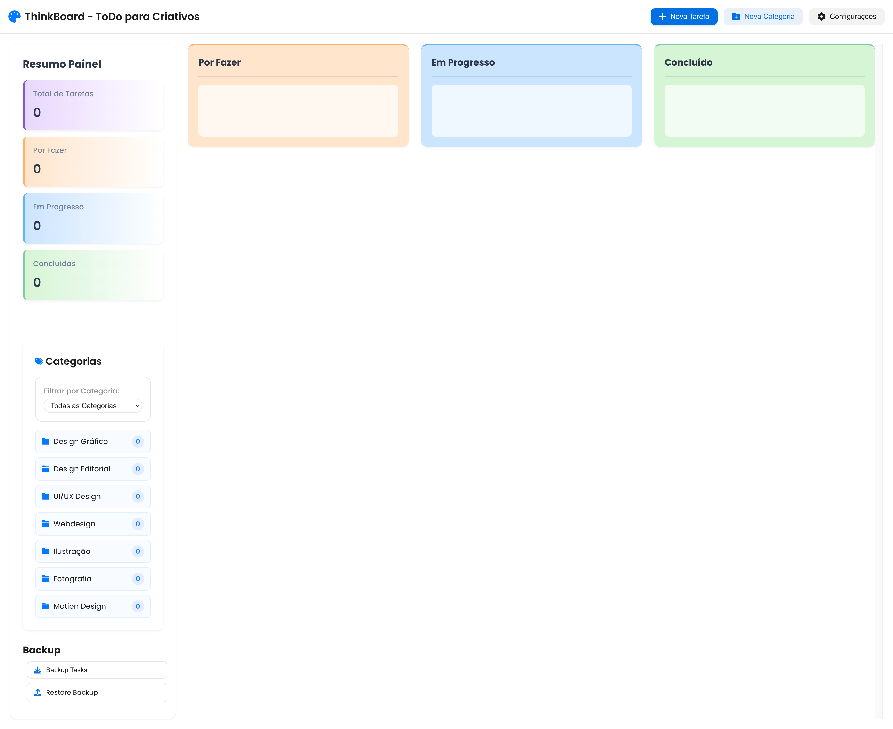

# 🎨 ThinkBoard - ToDo para Criativos

Um quadro Kanban moderno e elegante, projetado especificamente para profissionais criativos, com uma interface inspirada no design minimalista da Apple.



## 📋 Funcionalidades

- **Gestão Visual de Tarefas**
  - Três colunas com gradientes modernos:
    - 🟠 Por Fazer
    - 🔵 Em Progresso
    - 🟢 Concluído
  - Indicador de progresso visual em cada tarefa
  - Design responsivo e intuitivo

- **Organização de Tarefas**
  - Criação de tarefas com título e descrição
  - Suporte para upload de imagens
  - Sistema de categorias personalizáveis
  - Drag & drop para mover tarefas entre colunas

- **Interface Moderna**
  - Design inspirado na estética Apple
  - Efeitos de vidro fosco (frosted glass)
  - Animações suaves
  - Gradientes sutis e modernos

## 🚀 Como Usar

1. **Criar Nova Tarefa**
   - Clique no botão "Nova Tarefa"
   - Preencha o título e descrição
   - Adicione uma imagem (opcional)
   - Selecione ou crie uma categoria
   - Clique em "Guardar"

2. **Gerir Categorias**
   - Use o botão "Nova Categoria"
   - Atribua um nome e cor à categoria
   - As categorias aparecem no menu lateral
  ## Backup e Restauração de Tarefas

3. ** Como Fazer Backup das Suas Tarefas

1. **Localização**
   - Encontre a seção "Backup" na barra lateral do aplicativo
   - Procure o botão com ícone de download "Backup Tasks"

2. **Criar Backup**
   - Clique no botão "Backup Tasks"
   - Um arquivo JSON será baixado automaticamente
   - O nome do arquivo seguirá o formato: `creative-kavan-backup-YYYY-MM-DD.json`
   - Uma mensagem verde confirmará o sucesso da operação

3. **Armazenamento**
   - Guarde o arquivo de backup em local seguro
   - Recomendamos manter múltiplas versões de backup
   - O arquivo contém todas as suas tarefas e categorias

### Como Restaurar suas Tarefas

1. **Iniciar Restauração**
   - Na seção "Backup", localize o botão com ícone de upload "Restore Backup"
   - Clique no botão para abrir o seletor de arquivos

2. **Selecionar Arquivo**
   - Escolha o arquivo de backup (formato .json)
   - Somente arquivos de backup válidos serão aceitos
   - Uma mensagem verde confirmará o sucesso da restauração

3. **Após a Restauração**
   - Todas as suas tarefas serão restauradas automaticamente
   - As categorias também serão restauradas
   - O quadro Kanban será atualizado instantaneamente

### Dicas Importantes

- **Backups Regulares**: Faça backups periódicos para não perder suas tarefas
- **Antes de Limpar**: Sempre faça backup antes de limpar o cache do navegador
- **Verificação**: Após restaurar, confira se todas as tarefas foram recuperadas
- **Compatibilidade**: Use apenas arquivos de backup gerados pelo Creative Kavan
- **Segurança**: Não modifique manualmente os arquivos de backup

### Solução de Problemas

Se encontrar problemas durante o backup ou restauração:
1. Verifique se está usando um arquivo de backup válido
2. Certifique-se de que o arquivo não foi modificado
3. Tente usar um backup mais recente
4. Limpe o cache do navegador e tente novamente

### Observações

- O backup inclui todas as tarefas e suas propriedades
- Categorias personalizadas são incluídas no backup
- A restauração substitui completamente os dados existentes
- Mantenha seus arquivos de backup organizados por data

## 💻 Tecnologias Utilizadas

- HTML5
- CSS3 (com variáveis CSS para temas)
- JavaScript (Vanilla)
- Font Awesome para ícones

## 🎯 Recursos Especiais

- **Persistência de Dados**
  - Todas as tarefas e categorias são salvas localmente
  - Não requer backend ou banco de dados

- **Acessibilidade**
  - Interface otimizada para leitores de tela
  - Contraste adequado para melhor legibilidade
  - Suporte a navegação por teclado

- **Performance**
  - Carregamento rápido
  - Animações otimizadas
  - Sem dependências externas pesadas

## 🛠️ Instalação

1. Clone o repositório:
   ```bash
   git clone [URL do repositório]
   ```

2. Abra o ficheiro `index.html` no seu navegador

3. Comece a usar! Não é necessária nenhuma configuração adicional.

## 📱 Compatibilidade

- Chrome (recomendado)
- Safari
- Firefox
- Edge
- Dispositivos móveis e tablets

## 🤝 Contribuições

Contribuições são bem-vindas! Sinta-se à vontade para:
- Reportar bugs
- Sugerir novas funcionalidades
- Enviar pull requests

## 📄 Licença

Este projeto está sob a licença MIT. Consulte o ficheiro `LICENSE` para mais detalhes.

## 👨‍💻 Autor

Desenvolvido por Patricio Brito © 2024.

---

⭐️ Se este projeto foi útil para você, considere dar uma estrela no GitHub!
